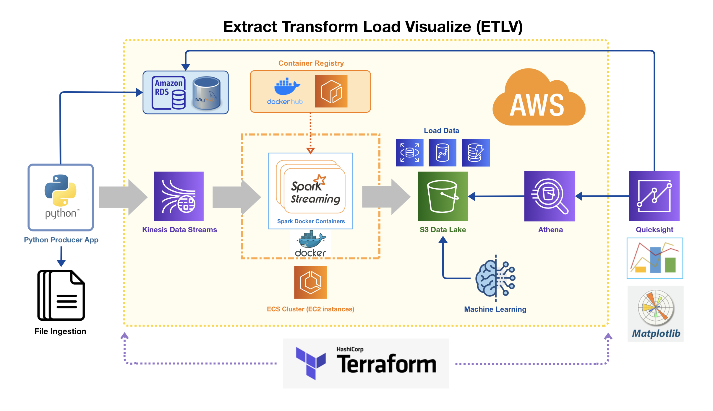

# Terraform Infrastructure

## Modules

* [./modules/ecs](./modules/ecs/README.md)
* [./modules/iam](./modules/iam/README.md)
* [./modules/kinesis](./modules/kinesis/README.md)
* [./modules/lambda](./modules/lambda/README.md)
* [./modules/rds](./modules/rds/README.md)
* [./modules/s3](./modules/s3/README.md)
* [terraform-aws-modules/vpc/aws](https://registry.terraform.io/modules/terraform-aws-modules/vpc/aws/latest)

## Variables

* `aws_region` - AWS region for the ECS cluster
* `kinesis_shard_count` - number of shards for Kinesis
* `spark_docker_image` - fully qualified name of Spark Docker image
* `key_name` - name of key pair for EC2 SSH access
* `ec2_instance_type` - type of EC2 container instance
* `s3_bucket_name` - name of the s3 bucket to load location data
* `lambda_enabled` - whether to include lambda consumer
* `rds_enabled` - whether to create the RDS instance
* `rds_username` - mysql database username
* `rds_password` - mysql database password
* `rds_publicly_accessible` - whether the RDS instance is publicly available
* `rds_db_name` - name of the database in the rds instance

## Outputs

* `s3_bucket_domain` - public DNS of the S3 bucket
* `s3_bucket_name` - name of the S3 bucket
* `spark_sts_user_access_key` - access key for Spark IAM user
* `spark_sts_user_secret_key` - key for Spark IAM user
* `ecs_spark_role_arn` - arn for Spark task role
* `rds_endpoint` - the endpoint for the RDS instance (host:port)
